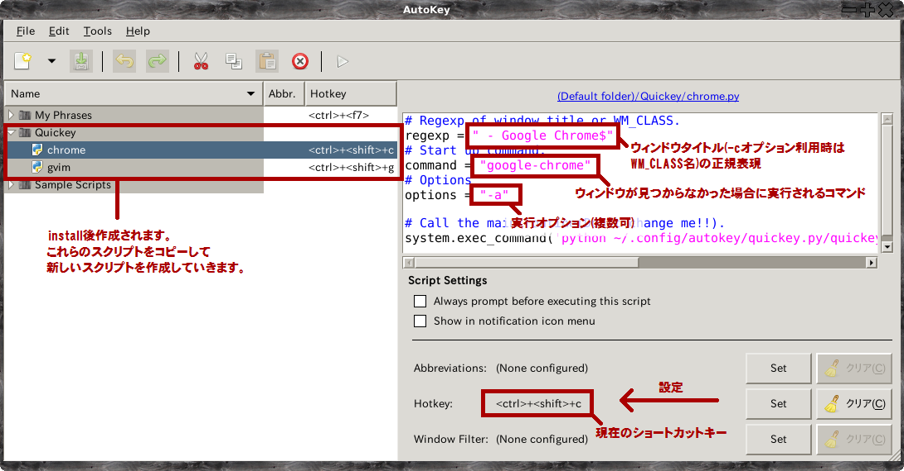

quickey.py
==========

# Mouse click? Alt + Tab? No, Quickey!!
Linux上で、予め検索条件を指定しておき、実行時に検索にHitしたウィンドウを、キーボードショートカット一発でアクティブ化する為のPythonスクリプトです。
アクティブ化する対象となるウィンドウが起動していない場合は、指定したコマンドを実行(例えばそのウィンドウを新たに起動したりも)できます。
任意のショートカットキーによる高速なタスク切り替え機能にランチャーがくっついたようなもんだと思ってください。
応用すれば、単なるショートカットランチャーとしても利用できます。

キーのバインド、及び対象ウィンドウ、コマンドの設定は、
Autokey( https://code.google.com/p/autokey/ )を利用して行います。
WinでいうところのAutoHotKeyのようなものです。
また、xbindkeysによる指定等も今後サポートする予定です。

Autokeyを利用すれば、キーバインドはGUIベースで簡単に行えます。
対象ウィンドウの検索条件指定及びコマンドの設定は、
インストール時にAutokeyに登録されるサンプルスクリプトをコピーして設定値を2行書き換えるだけの簡単仕様です。
同じようにコピーしてわずかな修正を加えるだけで、あらゆるウィンドウに対応できると思います。
また、ウィンドウの検索条件には正規表現が利用できます。

# Install(Autokeyを利用する場合)

## 事前準備

本スクリプトの動作には、Python, Autokey, wmctrlが必要です。
それぞれ以下のようにインストールしてください(Ubuntu、その他Debian系Distributionについて書いています)。

- Autokey

Google CodeよりAutokey(v0.90.4)を入手し(apt-getのバージョンではうまく動きません)、インストールします。

        $ wget https://autokey.googlecode.com/files/autokey-0.90.4.tar.gz
        $ tar zxvf autokey-0.90.4.tar.gz
        $ cd autokey-0.90.4
        $ sudo python setup.py install

- wmctrl

        $ sudo apt-get install wmctrl

AutokeyはPythonで動作している為、基本的には自動で入ると思います。

## 本体のインストール

基本的にはinstall.shを叩くだけです。
install.shを実行する事により ~/.config/autokey 配下にquickey.pyがコピーされます。
また、サンプルスクリプトも ~/.config/autokey/data/Quickey 配下にコピーされるので、
Autokeyの次回起動時に自動で読み込まれるようになっています。

このサンプルスクリプトは、quickey.pyが上記箇所にインストールされていることを前提として動作する為、
個別にカスタマイズしている方等は、quickey.pyをAutokeyの設定通りの場所にコピーし、
各サンプル及び作成済みのスクリプトの最終行で実行している quickey.py のパスを変更してください。

# 使い方

## Autokeyへの登録

インストールするとAutokeyのメニューにQuickeyフォルダが新しくできていますので、
その中のサンプルを適当にコピーして各種設定してください(初回起動では作成されないようなので、うまくいかなかった場合は一旦autokeyを終了した後、再度起動してみてください)。

画像1枚でわかるquickey.py(というかAutokey)の使い方。

### Optionについて

標準で以下のオプションに対応しており、それぞれoptionsに設定して利用することが可能です。

- -c ... 検索条件を、ウィンドウタイトルではなく <code>wmctrl -lx</code> を実行する等して得られる WM_CLASS 名に変更することができます。
常にタイトルが不定なNautilus等のファイラ類を指定したい際に役に立ちます。
- -a ... 検索条件にHitしたウィンドウを、プロセスを起動した順に全てアクティブ化します。つまり、起動したプロセスの新しいものが最終的にアクティブになります。
これを利用することで、ある程度のグループに対して一斉にウィンドウを前面に持ってくることができます。
- -r ... ウィンドウをアクティブ化する順番を逆にします。-aオプションが指定されていた場合は新しいプロセスから順に、最終的には最も古いプロセスがアクティブになりますし、
-aオプションを指定していなかった場合は、最も古いプロセスのみ前面に来るようにできます。

## 実はコマンドラインでも動きます(Autokeyを利用しない場合。インストール不要)

実は本スクリプトの内部ではAutokeyの組み込み関数を一切使用せずに作成している為、
Pythonから直接叩く事で、Autokeyを利用せずとも動作させることが可能です。
お使いのDesktop環境に応じて、キーボードショートカットとしてコマンドを登録させればすぐに使うことができます。
コマンドラインにてご利用の際には、以下のようなコマンドで実行してください。

    $ python path/to/dir/quickey.py/quickey.py [options(-a, -c, -r)] "Your regexp of window title" "Your command"

以下はGoogle Chromeのウィンドウを全てアクティブ化、存在しなければGoogle Chromeを起動するコマンドの例です。

    $ python path/to/dir/quickey.py/quickey.py -a " - Google Chrome$" "google-chrome"

# 最後に

バグ、要望、その他ご意見等御座いましたら下記よりお問い合わせください。

- Blog: http://m-yamashita.github.io/
- Mail: mxyamashita at gmail.com
